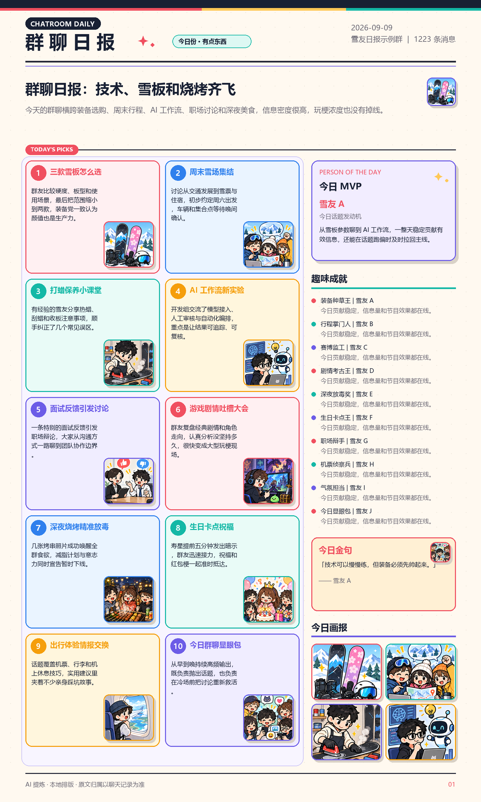

# 微信群聊 AI 总结工具

用 AI 自动总结微信群聊记录，支持按群聊和时间范围筛选，一键生成结构化摘要。

---

## 功能介绍

- **自动读取微信数据**：自动找到微信数据库，无需手动导出聊天记录
- **选择群聊和时间范围**：支持任意群聊，自由选择开始和结束日期
- **跨分库读取**：自动合并 `message_0.db`、`message_1.db` 等全部消息分片，近期与历史消息不会漏读
- **准确识别发言人**：通过消息表的发送者 ID 与联系人数据库匹配备注名/昵称，避免把被提及者误认为发言人
- **AI 智能总结**：默认使用 Google Gemini，也兼容 DeepSeek 官方 API 和 NVIDIA API Catalog
- **Gemini 3.8**：文字总结默认使用 `gemini-3.8-flash`，兼顾长上下文、速度和结构化输出
- **长记录不截断**：聊天内容自动分段提炼并汇总，避免只总结最后一部分
- **长群聊续跑**：按约 2.4 万字符分段处理并缓存已完成结果；中途失败后再次生成可从本机缓存继续
- **微信纯文本排版**：默认使用 emoji 和纯文本小标题，复制进微信群无需再整理 Markdown
- **固定手绘日报模板**：复刻蓝色报头、粗描边彩色分区、六宫格话题、前三名人物榜、趣味成就和底部三栏，固定输出 `1536×1536`
- **AI 话题配图**：Gemini 专用图片模型一次生成 `4×3` 手绘漫画素材板，再裁成 12 张栏目插画
- **现代桌面界面**：卡片式双栏工作台，数据、模型与结果一屏完成
- **免 Python 运行**：Windows EXE 可直接双击使用
- **任务可取消**：生成途中可点“取消任务”，当前网络请求结束后立即停止后续步骤
- **自动管理临时空间**：系统盘空间不足时自动改用程序所在盘存放解密临时文件，退出时清理
- **自定义提示词**：可修改 AI 的总结风格和格式
- **结果导出**：支持复制到剪贴板或保存为 TXT 文件

---

## 使用前提

- Windows 系统（仅支持 Windows）
- 微信电脑版 4.0 / 4.1 已安装并**保持登录状态**（已适配 4.1 新密钥结构）
- 推荐拥有已启用结算的 [Google AI Studio API Key](https://aistudio.google.com/apikey)；也可使用 DeepSeek 或 NVIDIA API Key

---

## 安装方法（推荐）

从项目 Release 下载 `ChatroomDigest.exe`，无需安装 Python，双击即可启动。

## 从源码运行

### 第一步：安装 Python

如果还没有安装 Python，前往 [python.org](https://www.python.org/downloads/) 下载安装。  
安装时勾选 **"Add Python to PATH"**。

### 第二步：安装依赖库

打开命令提示符（Win+R，输入 `cmd`），运行：

```
pip install -r requirements.txt
```

### 第三步：下载本项目

点击页面右上角绿色的 **Code** 按钮 → **Download ZIP**，解压到任意文件夹。

---

## 使用方法

### 第一步：选择 AI 服务并填写 API Key

打开工具，在左侧选择 **Google Gemini**，填入 Google AI Studio 创建的 Key。文字总结默认使用 `gemini-3.8-flash`；勾选 AI 插画后，程序会用同一 Key 调用 `gemini-3.1-flash-image`。两种用途不需要分别配置 Key。

Gemini API 属于按量计费服务，请先在对应 Google Cloud 项目启用结算并检查配额。Key 只保存在本机 `config.json` 中；该文件已加入 `.gitignore`，请勿提交或分享。

DeepSeek 官方和 NVIDIA API Catalog 仍作为兼容选项保留。切换服务商时，程序会自动切换到该服务商独立保存的 Key 与模型名。

> 仓库中的 `config.example.json` 仅作格式示例，不包含真实凭据。

#### NVIDIA 免费接口

1. 登录 [NVIDIA API Catalog](https://build.nvidia.com/)，打开带 **Free Endpoint** 的文本模型。
2. 点击模型页的 **Generate API Key**。
3. 在工具中选择“NVIDIA API Catalog”并粘贴 Key。

默认模型为更适合长文本摘要的 `deepseek-ai/deepseek-v4-flash-0731`。旧版本保存的默认 Pro 模型会自动迁移为 Flash；用户手动填写的其他模型不会被修改。模型名可以直接编辑；如果 NVIDIA 返回模型不存在，请从当前模型页复制最新的 `model` 值。免费模型、频率、额度和可用性可能变化，以 NVIDIA 页面当时显示为准。

长聊天会按约 2.4 万字符分段处理。每一段完成后只在本机缓存 AI 的提炼结果（不缓存聊天原文），如果后续请求超时，再次生成会从已完成的段落继续。源码版缓存位于项目的 `.summary_cache`，EXE 版位于 `%LOCALAPPDATA%\ChatroomDigest\.summary_cache`。

NVIDIA 免费端点高负载时可能变慢。单次请求最多等待 120 秒且不再静默长时间重试；每个阶段和分段进度会直接显示在主面板。

### 第二步：运行工具

直接双击 `ChatroomDigest.exe`。从源码使用时运行：

```
python wechat_gui.py
```

### 第三步：初始化

确保微信电脑版已登录，点击「**自动初始化**」按钮。  
工具会自动找到微信数据库，并根据微信版本选择密钥提取方式后完成解密
（需要微信保持运行）。微信 4.1 使用只读 `Config.Cipher` 扫描，无需管理员权限。

> 如果自动检测失败，点击「手动选择文件夹」，在微信设置 → 文件管理中找到数据存储路径，选择形如 `wxid_xxxxxxxx` 的文件夹。

### 第四步：选择群聊和时间

- 从下拉框中选择要总结的群聊
- 选择开始和结束日期（默认最近 7 天）

### 第五步：生成总结

点击「**生成总结**」，等待 AI 处理完成，结果会显示在下方文本框中。  
可以点击「复制到剪贴板」或「保存为 TXT」导出结果。

如果需要发到群里的一页报纸，点击「**生成图片日报**」：

1. 选择 PNG 保存位置。
2. AI 将聊天压缩为最多 6 个热门话题、3 名风云人物、6 个趣味成就、7 条群聊金句，以及明日话题和特别关注。
3. 启用“AI 话题插画”时，`gemini-3.1-flash-image` 一次生成无文字的 `4×3` 手绘漫画素材板，程序再按固定栏目裁切。
4. 程序在本地排版成单张 `1536×1536` PNG；栏目位置和整体风格不会随模型输出改变。

图片中的中文仍由程序本地排版，因此不会出现 AI 图片中常见的中文乱码；图片模型只绘制无文字的漫画插画。配图使用 Gemini API Key：如果文字总结也选择 Gemini，就会直接共用当前 Key；如果文字选择 DeepSeek/NVIDIA，则需要先在 Gemini 服务项中保存一次 Key。关闭“AI 话题插画”后不会调用图片接口。如果刚刚已生成同一群、同一日期的文字总结，图片功能会直接复用，避免重复总结。

## 自己构建 EXE

在 PowerShell 中运行：

```powershell
.\build_exe.ps1
```

脚本会安装构建所需的 PyInstaller，并在 `dist\ChatroomDigest.exe` 生成单文件程序。EXE 版的配置保存在 `%LOCALAPPDATA%\ChatroomDigest\config.json`；首次从本项目的 `dist` 目录运行时，也会读取项目根目录已有的配置。

---

## 界面说明



| 区域 | 说明 |
|------|------|
| 第一步：初始化 | 读取微信数据库，获取群聊列表 |
| 第二步：选择群聊 | 从下拉框选择要总结的群 |
| 第三步：时间范围 | 选择起止日期 |
| 生成总结 | 调用 AI 生成摘要 |
| 第四步：AI 服务 | 默认选择 Gemini 3.8；也可切换 DeepSeek 或 NVIDIA，并编辑模型名 |
| 生成图片日报 | 使用固定手绘漫画模板输出单张方形信息图 PNG |

---

## 常见问题

**Q：点击初始化提示"未能提取到密钥"**  
A：新版已兼容微信 4.1 的 `Config.Cipher` 密钥结构。请确保微信电脑版已打开并登录；
如果微信刚完成升级，请完全退出微信、重新打开并登录，等待主界面加载后再初始化。

**Q：自动检测数据目录失败**  
A：点击「手动选择文件夹」。在微信电脑版 → 设置 → 文件管理，找到"微信文件的存储位置"，进入该目录，选中形如 `wxid_xxxxxxxx` 的文件夹。

**Q：API Key 从哪里获取？**  
A：Gemini Key 在 [Google AI Studio](https://aistudio.google.com/apikey) 创建；DeepSeek Key 在 [DeepSeek 开放平台](https://platform.deepseek.com/api_keys) 创建；NVIDIA Key 在 [NVIDIA API Catalog](https://build.nvidia.com/) 的模型页创建。

**Q：DeepSeek 提示 402 余额不足怎么办？**
A：可以充值，或在界面中直接切换到 Google Gemini。工具会对常见鉴权、余额、配额和服务繁忙错误给出中文提示。

**Q：为什么文字模型和图片模型不是同一个？**
A：`gemini-3.8-flash` 用于理解聊天和生成结构化日报内容；`gemini-3.1-flash-image` 专门生成无文字插画。程序自动分工，两者共用一个 Gemini API Key。

**Q：NVIDIA 提示 `Read timed out`怎么办？**
A：这表示已经连上 NVIDIA，但模型在 120 秒内没有返回完整结果，通常不是 Key 错误。请稍后重试，或换用其他 Free Endpoint 模型。

**Q：API Key 会泄露吗？**  
A：Key 只明文保存在你本机且已被 Git 忽略的 `config.json` 中，不会上传到本项目仓库；生成总结时，程序会将当前 Key 作为身份凭证发送给你选择的 API。

**Q：支持个人聊天（非群聊）吗？**  
A：暂不支持，目前只能总结群聊记录。

---

## 注意事项

- 本工具通过读取本地微信数据库工作，**不会登录你的微信账号**，也不会发送任何消息
- 生成 AI 总结时，所选时间范围内的文本消息会发送给你选择的 Gemini、DeepSeek 或 NVIDIA API，请确认群成员同意并遵守当地隐私法规
- 仅支持 Windows 微信 4.0 / 4.1 版本；微信后续若再次调整内部数据库结构，可能需要同步升级提取器
- 请勿将本工具用于非法用途

---

## 依赖库

| 库 | 用途 |
|----|------|
| tkcalendar | 日期选择控件 |
| pycryptodome | 解密微信数据库 |
| requests | 调用 Gemini / DeepSeek / NVIDIA API |
| psutil | 自动定位微信数据目录 |
| Pillow | 本地渲染报纸杂志风 PNG |

---

## 许可证

本项目采用 [MIT License](LICENSE)。
