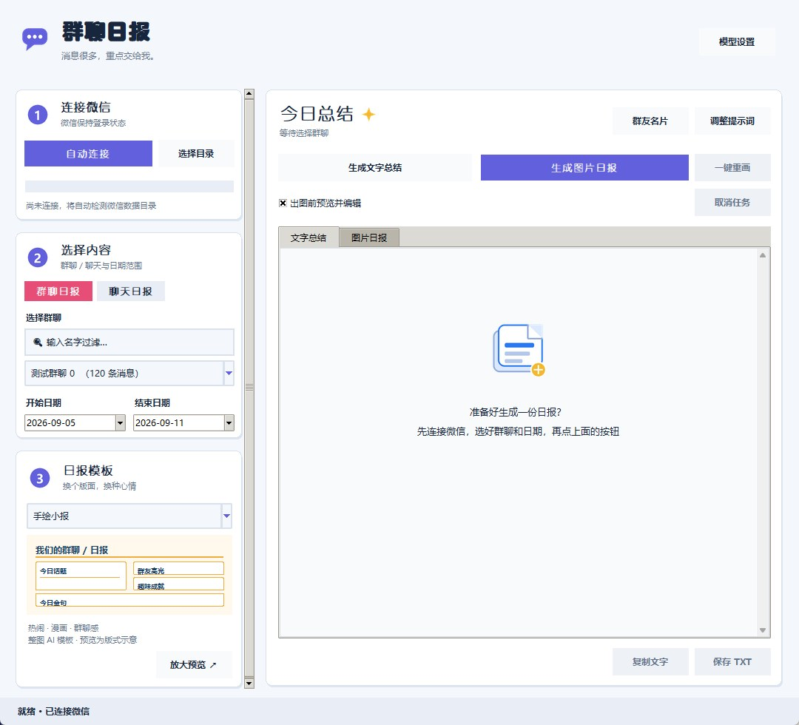
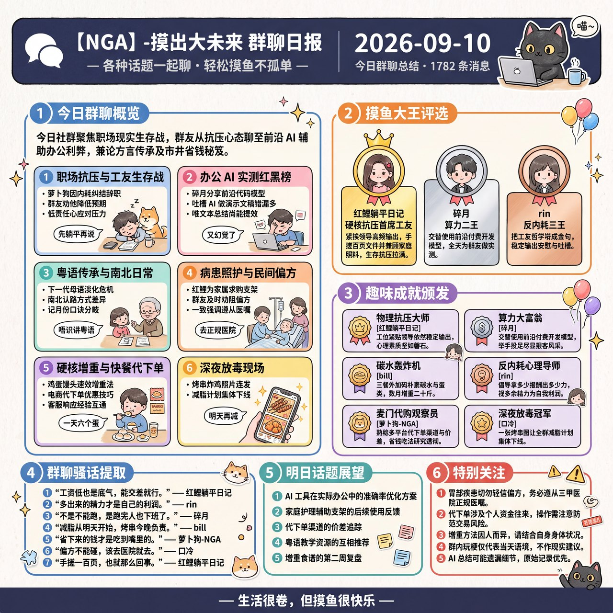

# 微信群聊 AI 总结工具

用 AI 自动总结微信群聊记录，支持按群聊和时间范围筛选，一键生成结构化摘要。

---

## 功能介绍

- **自动读取微信数据**：自动找到微信数据库，无需手动导出聊天记录
- **选择群聊和时间范围**：支持任意群聊，自由选择开始和结束日期
- **跨分库读取**：自动合并 `message_0.db`、`message_1.db` 等全部消息分片，近期与历史消息不会漏读
- **准确识别发言人**：通过消息表的发送者 ID 与联系人数据库匹配备注名/昵称，避免把被提及者误认为发言人
- **AI 智能总结**：默认使用 Google Gemini，也兼容 DeepSeek 官方 API
- **Gemini 3.8**：文字总结默认使用 `gemini-3.8-flash`，兼顾长上下文、速度和结构化输出
- **长记录不截断**：聊天内容自动分段提炼并汇总，避免只总结最后一部分
- **长群聊续跑**：按约 2.4 万字符分段处理并缓存已完成结果；中途失败后再次生成可从本机缓存继续
- **微信纯文本排版**：默认使用 emoji 和纯文本小标题，复制进微信群无需再整理 Markdown
- **整图 AI 海报**：把整份日报文案交给 `gemini-3-pro-image` 一次画完 `4096×4096`，含中文标题、卡片、对白气泡和吉祥物，最接近精致手绘风格
- **固定手绘日报模板**：备用的本地排版路线，复刻蓝色报头、粗描边彩色分区、话题宫格、人物榜、趣味成就和底部三栏，固定输出 `1536×1536`
- **AI 话题配图**：本地排版模式下由 Gemini 图片模型生成手绘漫画素材，再裁成栏目插画
- **手绘风桌面界面**：与日报同一套配色的圆角卡片工作台，图标由 Pillow 现画，无外部素材
- **免 Python 运行**：Windows EXE 可直接双击使用
- **任务可取消**：生成途中可点“取消任务”，当前网络请求结束后立即停止后续步骤
- **自动管理临时空间**：系统盘空间不足时自动改用程序所在盘存放解密临时文件，退出时清理
- **自定义提示词**：可修改 AI 的总结风格和格式
- **结果导出**：支持复制到剪贴板或保存为 TXT 文件

---

## 使用前提

- Windows 系统（仅支持 Windows）
- 微信电脑版 4.0 / 4.1 已安装并**保持登录状态**（已适配 4.1 新密钥结构）
- 推荐拥有已启用结算的 [Google AI Studio API Key](https://aistudio.google.com/apikey)；也可使用 DeepSeek API Key

---

## 下载

前往 **[Releases 页面](https://github.com/Saigetsu233/wechat-summary-tool/releases/latest)**
下载最新的 `ChatroomDigest.exe`，无需安装 Python，双击即可启动。

首次启动后在左侧填入 API Key 并保存，Key 只写在本机的 `config.json` 里。
想从源码运行见下方「从源码运行」。

## 从源码运行

### 第一步：安装 Python

如果还没有安装 Python，前往 [python.org](https://www.python.org/downloads/) 下载安装。  
安装时勾选 **"Add Python to PATH"**。

### 第二步：安装依赖库

打开命令提示符（Win+R，输入 `cmd`），运行：

```
pip install -r requirements.txt
```

### 第三步：下载本项目

点击页面右上角绿色的 **Code** 按钮 → **Download ZIP**，解压到任意文件夹。

---

## 使用方法

### 第一步：选择 AI 服务并填写 API Key

打开工具，在左侧选择 **Google Gemini**，填入 Google AI Studio 创建的 Key。文字总结默认使用 `gemini-3.8-flash`；勾选 AI 插画后，程序会用同一 Key 调用 `gemini-3.1-flash-image`。两种用途不需要分别配置 Key。

Gemini API 属于按量计费服务，请先在对应 Google Cloud 项目启用结算并检查配额。Key 只保存在本机 `config.json` 中；该文件已加入 `.gitignore`，请勿提交或分享。

DeepSeek 官方接口仍作为兼容选项保留。切换服务商时，程序会自动切换到该服务商独立保存的 Key 与模型名。

> 仓库中的 `config.example.json` 仅作格式示例，不包含真实凭据。

长聊天会按约 2.4 万字符分段处理。每一段完成后只在本机缓存 AI 的提炼结果（不缓存聊天原文），如果后续请求超时，再次生成会从已完成的段落继续。源码版缓存位于项目的 `.summary_cache`，EXE 版位于 `%LOCALAPPDATA%\ChatroomDigest\.summary_cache`。

每个阶段和分段进度会直接显示在主面板。

### 第二步：运行工具

直接双击 `ChatroomDigest.exe`。从源码使用时运行：

```
python wechat_gui.py
```

### 第三步：初始化

确保微信电脑版已登录，点击「**自动初始化**」按钮。  
工具会自动找到微信数据库，并根据微信版本选择密钥提取方式后完成解密
（需要微信保持运行）。微信 4.1 使用只读 `Config.Cipher` 扫描，无需管理员权限。

> 如果自动检测失败，点击「手动选择文件夹」，在微信设置 → 文件管理中找到数据存储路径，选择形如 `wxid_xxxxxxxx` 的文件夹。

### 第四步：选择群聊和时间

- 从下拉框中选择要总结的群聊
- 选择开始和结束日期（默认最近 7 天）

### 第五步：生成总结

点击「**生成总结**」，等待 AI 处理完成，结果会显示在下方文本框中。  
可以点击「复制到剪贴板」或「保存为 TXT」导出结果。

如果需要发到群里的一页报纸，点击「**生成图片日报**」：

1. 选择 PNG 保存位置。
2. AI 将聊天压缩为最多 6 个热门话题、3 名风云人物、6 个趣味成就、7 条群聊金句，以及明日话题和特别关注。
3. 在插画模式下拉框里选一种画法（见下）。
4. 保存单张 PNG。

### 三种插画模式

| 模式 | 画法 | 调用次数 | 取舍 |
| --- | --- | --- | --- |
| **整图 AI 海报**（默认） | 把整页文案写进提示词，由 `gemini-3-pro-image` 直接画出整张 `1:1`、`4K` 海报，中文字也由模型书写 | 1 | 最接近精致手绘：卡内有带对白气泡的小漫画、吉祥物、手写贴纸，气泡还能压出卡片边框。代价是偶发错字和版式微调，重跑一次即可换一版 |
| **本地排版 + 逐格精绘** | 本地画版面，按栏目逐张生成插画贴进卡片 | 最多 9 | 文字 100% 准确，插画贴合各自话题，但插画只能待在固定小方框里 |
| **本地排版 + 单次联系表** | 一次生成 `4×3` 素材板再裁成 12 张 | 1 | 最省钱，插画与话题的贴合度最弱 |

选择“整图 AI 海报”时，程序会自动把“图片模型”切到 `gemini-3-pro-image`——只有它能可靠地写中文；用 flash 图片模型跑整图模式会得到糊掉的假字。整图默认按 `1:1`、`4K` 出图（`4096×4096`），画满一页文字比小插画慢得多，读超时放宽到 10 分钟。

**整图模式的已知限制**：整页约七百个汉字里，通常会有一到三个多笔画字被写成形近的错字（大字号的标题、要点、金句基本无误，出错集中在中等字号的成就说明一类）。这是模型书写中文的固有局限，不满意就重跑一次换一版；要文字零差错就用本地排版模式。

整图模式若失败（额度、审核或没返回图片），程序会自动退回本地排版版本并弹窗说明，日报内容不会丢。两条本地排版路线的中文都由程序绘制，不会出现 AI 图片常见的中文乱码。配图使用 Gemini API Key：如果文字总结也选择 Gemini，就会直接共用当前 Key；如果文字选择 DeepSeek，则需要先在 Gemini 服务项中保存一次 Key。关闭“AI 话题插画”后不会调用图片接口，直接输出纯本地排版。如果刚刚已生成同一群、同一日期的文字总结，图片功能会直接复用，避免重复总结。

### 不碰微信数据也能验证出图

想先看效果、调风格，不用连微信数据库，用仓库里的 `verify_poster.py` 跑内置样例：

```bash
python verify_poster.py --prompt-only
```

```bash
python verify_poster.py --fallback --open
```

```bash
python verify_poster.py --open
```

依次是：只打印整图提示词（不调接口）、只渲染本地排版兜底版（不需要 Key）、真调 `gemini-3-pro-image` 出整图。
Key 的取用顺序是 `--key` > 环境变量 `GEMINI_API_KEY` > `config.json`。
还可以用 `--aspect 4:5`、`--size 2K` 换画幅，或用 `--dump-digest x.json` 导出内容、改完再 `--digest x.json` 传回来。

## 自己构建 EXE

在 PowerShell 中运行：

```powershell
.\build_exe.ps1
```

脚本会安装构建所需的 PyInstaller，并在 `dist\ChatroomDigest.exe` 生成单文件程序。EXE 版的配置保存在 `%LOCALAPPDATA%\ChatroomDigest\config.json`；首次从本项目的 `dist` 目录运行时，也会读取项目根目录已有的配置。

---

## 界面说明



整图 AI 海报模式（默认，`gemini-3-pro-image` 一次画完，示例已缩图）：



本地排版模式（文字由程序绘制，零错字）：


| 区域 | 说明 |
|------|------|
| 第一步：初始化 | 读取微信数据库，获取群聊列表 |
| 第二步：选择群聊 | 从下拉框选择要总结的群 |
| 第三步：时间范围 | 选择起止日期 |
| 生成总结 | 调用 AI 生成摘要 |
| 第四步：AI 服务 | 默认选择 Gemini 3.8；也可切换 DeepSeek，并编辑模型名 |
| 插画模式 | 在「生成图片日报」下方选画法，并挑选对应的图片模型 |
| 生成图片日报 | 输出单张方形信息图 PNG：整图 AI 海报或本地手绘模板 |

---

## 常见问题

**Q：点击初始化提示"未能提取到密钥"**  
A：新版已兼容微信 4.1 的 `Config.Cipher` 密钥结构。请确保微信电脑版已打开并登录；
如果微信刚完成升级，请完全退出微信、重新打开并登录，等待主界面加载后再初始化。

**Q：自动检测数据目录失败**  
A：点击「手动选择文件夹」。在微信电脑版 → 设置 → 文件管理，找到"微信文件的存储位置"，进入该目录，选中形如 `wxid_xxxxxxxx` 的文件夹。

**Q：API Key 从哪里获取？**  
A：Gemini Key 在 [Google AI Studio](https://aistudio.google.com/apikey) 创建；DeepSeek Key 在 [DeepSeek 开放平台](https://platform.deepseek.com/api_keys) 创建。

**Q：DeepSeek 提示 402 余额不足怎么办？**
A：可以充值，或在界面中直接切换到 Google Gemini。工具会对常见鉴权、余额、配额和服务繁忙错误给出中文提示。

**Q：为什么文字模型和图片模型不是同一个？**
A：`gemini-3.8-flash` 用于理解聊天和生成结构化日报内容；`gemini-3-pro-image` 用于整图 AI 海报（自己写中文），`gemini-3.1-flash-image` 用于本地排版模式下的无文字插画。程序自动分工，共用一个 Gemini API Key。

**Q：API Key 会泄露吗？**  
A：Key 只明文保存在你本机且已被 Git 忽略的 `config.json` 中，不会上传到本项目仓库；生成总结时，程序会将当前 Key 作为身份凭证发送给你选择的 API。

**Q：支持个人聊天（非群聊）吗？**  
A：暂不支持，目前只能总结群聊记录。

---

## 注意事项

- 本工具通过读取本地微信数据库工作，**不会登录你的微信账号**，也不会发送任何消息
- 生成 AI 总结时，所选时间范围内的文本消息会发送给你选择的 Gemini 或 DeepSeek API，请确认群成员同意并遵守当地隐私法规
- 仅支持 Windows 微信 4.0 / 4.1 版本；微信后续若再次调整内部数据库结构，可能需要同步升级提取器
- 请勿将本工具用于非法用途

---

## 依赖库

| 库 | 用途 |
|----|------|
| tkcalendar | 日期选择控件 |
| pycryptodome | 解密微信数据库 |
| requests | 调用 Gemini / DeepSeek API |
| psutil | 自动定位微信数据目录 |
| Pillow | 本地渲染报纸杂志风 PNG，并绘制界面图标 |

---

## 许可证

本项目采用 [MIT License](LICENSE)。
# 桌面界面与日报模板

新版将 API Key、文字模型和绘图模式收进右上角「模型设置」。主界面提供文字 / 图片结果标签页，生成后可在图片页查看，双击打开原图。

左侧「日报模板」提供手绘小报、周末杂志、薄荷快报、午夜电台，可查看缩略版式或点击「放大预览」。预览是配色和版式示意，不是模型实测成图；AI 的实际插画、文字与布局仍可能变化。

选择模板会切换到整图 AI 绘图模式。模板暂只作用于整图海报，本地排版保留经典样式。出图前预览编辑和一键重画继续可用；重画复用文案并使用当前模板，再次调用图片接口可能产生费用。模板偏好在正常退出时保存。
